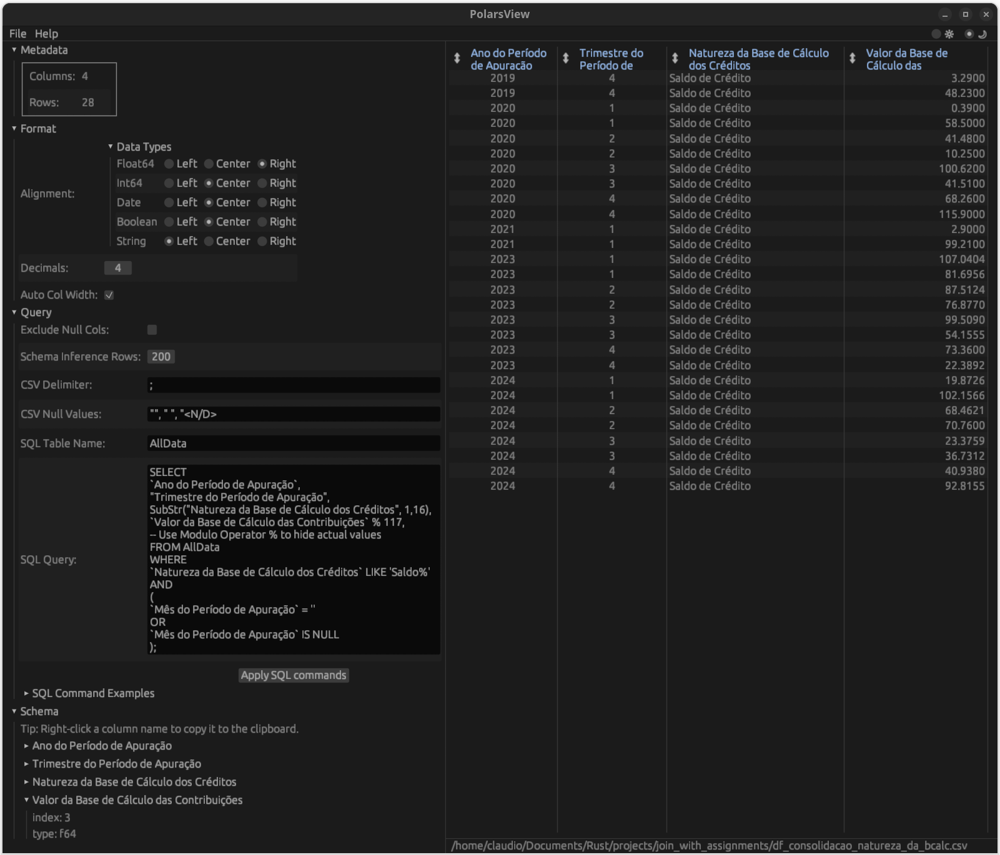

# PolarsView

[](https://crates.io/crates/polars-view)
[](https://docs.rs/polars-view)
[](LICENSE)
[](https://www.rust-lang.org)



A fast and interactive viewer for CSV, Json and Parquet data, built with Polars and egui.

This project is inspired by and forked from the [parqbench](https://github.com/Kxnr/parqbench) project.

## Features

* **Fast Loading:** Leverages Polars for efficient data loading and processing.
* **CSV, Json and Parquet Support:** Handles CSV, Json (and Newline-Delimited Json) and Parquet file formats.
* **Save as:**  Save to file and select `CSV`, `Json`, `NDJson` or `Parquet` format.
* **SQL Querying:** Apply SQL queries to filter and transform data.  Uses Polars' SQLContext for query execution.
* **Data Filtering:** Provides UI elements for setting CSV delimiters, schema inference length, and decimal precision. Automatic delimiter detection for CSV files.
* **Metadata Display:** Shows file metadata (column count, row count) and schema information.
* **Sorting Capabilities**: Interactive column sorting (ascending/descending).
* **Asynchronous Operations:** Uses Tokio for non-blocking file loading, saving, and query execution.
* **Error Handling**: Custom error enum (`PolarsViewError`) for robust error handling and informative error messages.  Errors are displayed in a dedicated notification window.
* **Styled UI**:  Custom styling for improved visual appearance (dark mode, fonts, spacing).
* **Drag and Drop**:  Supports dragging and dropping files directly onto the application window.

## Building and Running

1.  **Prerequisites:**
    *   Rust and Cargo (latest stable version recommended, minimum version 1.85).

2.  **Clone the Repository:**

    ```bash
    git clone https://github.com/claudiofsr/polars-view.git
    cd polars-view
    ```

3.  **Build and Install:**

    ```bash
    cargo b -r && cargo install --path=.
    ```

4.  **Run:**

    ```bash
    polars-view [path_to_file] [options]
    ```

    *   Replace `[path_to_file]` with the actual path to your CSV, Json or Parquet file.
    *   Use `polars-view --help` for a list of available options (delimiter, query, table name).
    *   **Tracing Options (for logging):**  To enable detailed logging, use the `RUST_LOG` environment variable:

        ```bash
        RUST_LOG=info polars-view [path_to_file] [options]  # General info logs
        RUST_LOG=debug polars-view [path_to_file] [options] # More detailed logs
        RUST_LOG=trace polars-view [path_to_file] [options] # Very detailed logs (for debugging)
        ```
        You can also specify the log level for specific modules:
        ```bash
        RUST_LOG=polars_view=debug,polars=info polars-view [path_to_file] [options]
        ```

    *   Examples:
        ```bash
        polars-view data.parquet
        polars-view --delimiter ';' data.csv --query "SELECT * FROM mytable WHERE x > 10"
        polars-view data.csv -q "Select Linhas, \`Valor Total do Item\` From AllData Where Linhas < 30"
        polars-view data.csv -q "Select Linhas, \"Valor Total do Item\" From AllData Where Linhas < 30"
        RUST_LOG=info polars-view data.parquet
        ```

## Usage

*   **Open a File:**
    *   Run the application with a file path as an argument.
    *   Use the "File" -> "Open" menu option.
    *   Drag and drop a CSV, Json or Parquet file onto the application window.

*   **Filtering:**
    *   Use the "Query" panel to set CSV delimiter, schema inference length, and decimal places.  The application will automatically attempt to detect the CSV delimiter.
    *   Enter SQL queries in the "SQL Query" field.  The default table name is "AllData," but you can change this with the `--table-name` argument or in the "Query" panel.
    *   Click "Apply" to apply the filters and execute the SQL query (if provided).

*   **Sorting:**
    *   Click the column headers in the table to sort by that column (ascending/descending). The sort state cycles through Not Sorted -> Descending -> Ascending -> Not Sorted.  The entire DataFrame is sorted, not just the visible rows.

*   **Metadata:**
    *   The "Metadata" panel shows file metadata.
    *   The "Schema" panel displays the data schema.

*   **SQL Examples:**

    The interface includes a "SQL Command Examples" section that provides pre-defined SQL commands based on the loaded data's schema. These cover various common filtering and aggregation operations. See [Polars SQL documentation](https://docs.pola.rs/api/python/stable/reference/sql/index.html).  The examples are dynamically generated to reflect the column names and data types of your specific file.

    ```sql
    SELECT * FROM AllData;
    SELECT * FROM AllData WHERE column_name > value;
    SELECT column1, COUNT(*) FROM AllData GROUP BY column1;
    ```
    
*   **Save as:**
   *   Use the "File" -> "Save as" menu option.
   *    Select one of supported formats to save `CSV`, `Json`, `NDJson` or `Parquet`.
   
## Dependencies

*   [Polars](https://www.pola.rs/): High-performance DataFrame library.
*   [eframe](https://crates.io/crates/eframe): Immediate-mode GUI library.
*   [egui](https://github.com/emilk/egui): Immediate-mode GUI library.
*   [egui_extras](https://docs.rs/egui_extras/latest/egui_extras/): Complement egui features
*   [clap](https://crates.io/crates/clap): Command-line argument parser.
*   [tokio](https://tokio.rs/): Asynchronous runtime.
*   [tracing](https://crates.io/crates/tracing): Application-level tracing framework.
*   [thiserror](https://crates.io/crates/thiserror): Library for deriving the `Error` trait.
*   [rfd](https://crates.io/crates/rfd): Native file dialogs.
*   [anstyle](https://crates.io/crates/anstyle): Print styled output to terminal.

## Contributing

Contributions are welcome! Please open an issue or submit a pull request.

## License

This project is licensed under the [MIT License](LICENSE).
